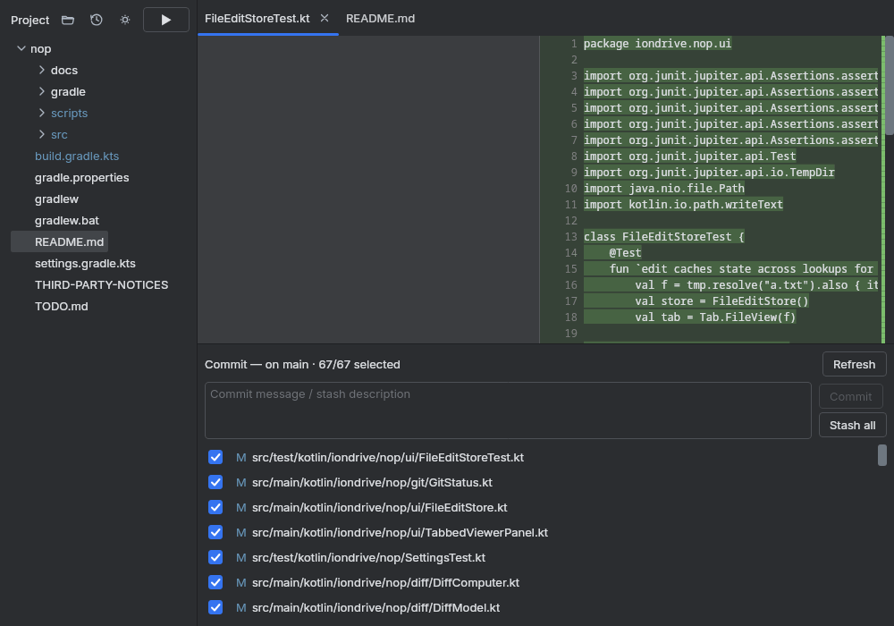
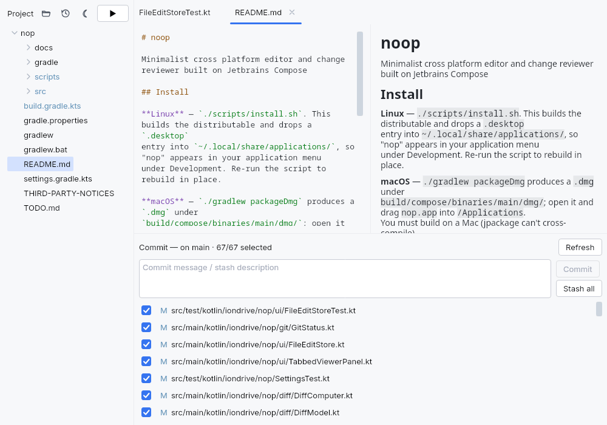

# nop

Minimalist cross platform editor and change reviewer built on Jetbrains Compose

Download the latest installer for your platform from the
[releases page](https://github.com/iondrive-co/nop/releases/latest):

<!-- screenshot -->

<!-- screenshot -->

## Shortcuts

- Select a file or directory in the project tree, then:
	- `Delete` — remove it from disk (asks for confirmation first)
	- `H` — open a tab showing its git history
- Ctrl click on an element in a file to jump to source.
- Ctrl F to search within the current file
- Ctrl Shift F to search across all files
- Shift-Shift to search for file
