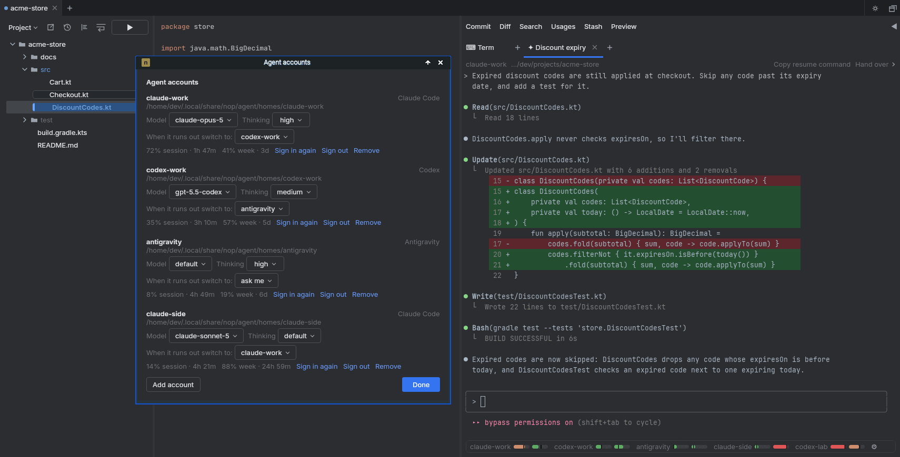
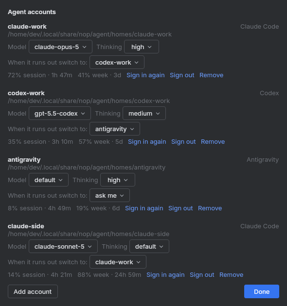

# nop

Cross platform editor and change reviewer with built in multi-agent account management.

Download the latest installer for your platform from the
[releases page](https://github.com/iondrive-co/nop/releases/latest):

<!-- screenshot -->

### Run coding agents beside your code

Claude Code, Codex and Antigravity with session handover between them. The strip along the bottom shows every account's session and weekly
usage. Every agent shares one memory file, `~/.local/share/nop/agent/memory/memory.md`, so what one session learns reaches the
next, whichever account or tool it runs on.

### Visual review built on Jetbrains Compose framework

### Multiple project tabs per window

Multiple tabs for different views / agents on the same project, or different projects. Multiple windows for different project groups.

<!-- screenshot -->

## Shortcuts

- Ctrl click on an element to jump to source
- Ctrl F search within current file
- Ctrl R to find and replace within current file
- Ctrl Shift F to search across all files
- Shift-Shift to search for file
- F4 from a diff to open the file
- F5 reload git status / re-read active tab from disk
- `Alt F7` list usages
- `Shift F6` rename

When a file or directory is selected:
	- `Delete` — remove it from disk
	- `Ctrl C` — copy to clipboard
	- `Ctrl V` — paste the clipboard into the selected directory, or beside the selected file.
	- `F2` — rename
	- `H` — open a git history tab
	- `B` — toggle the git blame column in the editor

In a terminal, a launcher run or an agent session:
	- `Shift Enter` — insert a newline
	- `Ctrl C` — copy selection or interupt run if nothing selected
	- `Ctrl Shift V` or `Shift Insert` — paste

## Troubleshooting

Check `$XDG_CONFIG_HOME/nop/nop.log` (default `~/.config/nop/nop.log`), and file an issue if necessary.
