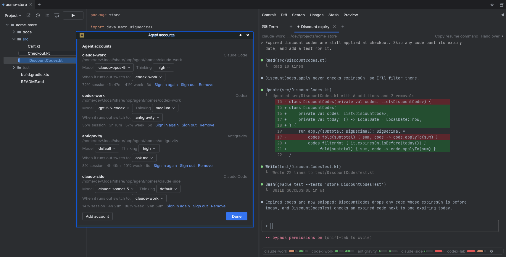
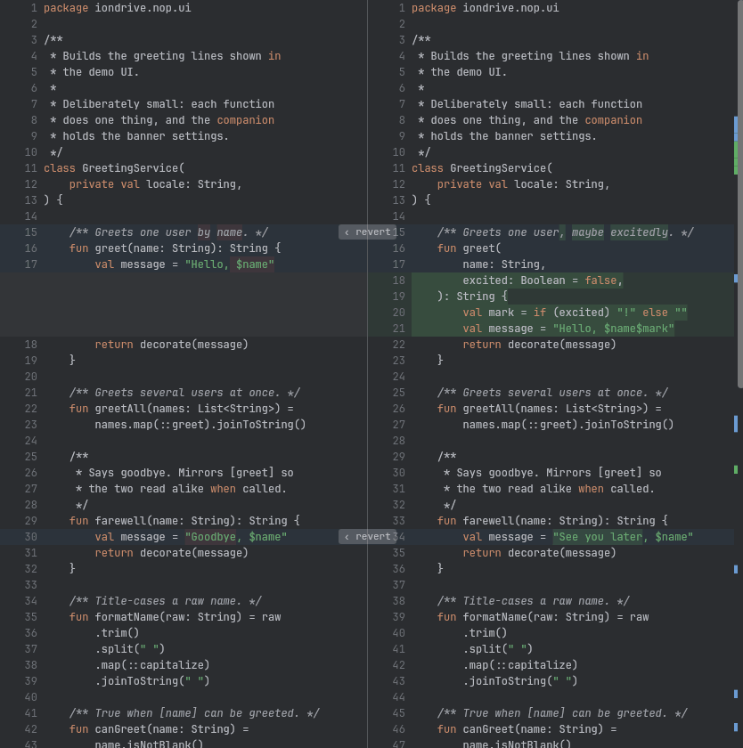
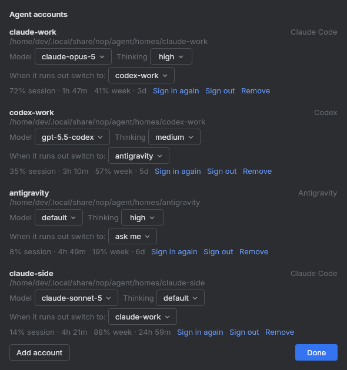
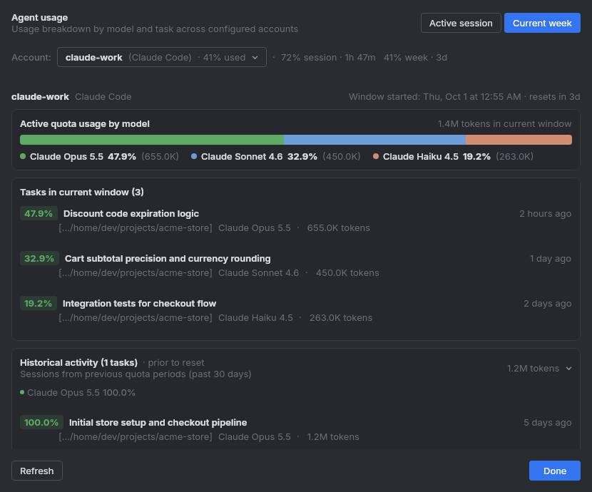
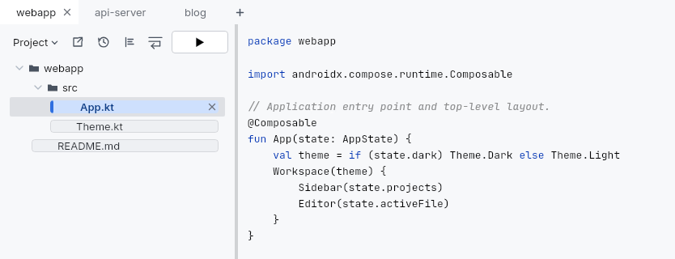

# nop

Cross platform editor and change reviewer with built in multi-agent account management.

Download the latest installer for your platform from the
[releases page](https://github.com/iondrive-co/nop/releases/latest):

<!-- screenshot -->

### Run coding agents beside your code

Claude Code, Codex and Antigravity sessions from any of your accounts can run in tabs next to the editor. 
Agents can message each other (by default with you approving each but this can be made automatic per project)
and can share memory.

### Review what changed

### Manage all your accounts in one place

Set each account's model and thinking level and resume it or hand it over to another provider when it hits a quota.

### Track where your usage goes

See what percentage of your quota goes to different models and tasks.

### Keep projects in tabs

Open several projects in one window, each with its own file tree and editor tabs.

<!-- screenshot -->

## Shortcuts

- Ctrl click on an element to jump to source
- Ctrl F search within current file
- Ctrl R to find and replace within current file
- Ctrl Shift F to search across all files
- Shift-Shift to search for file
- F4 from a diff to open the file
- F5 reload git status / re-read active tab from disk
- `Alt F7` list usages
- `Shift F6` rename
- `Ctrl+Alt+Left` previous file

When a file or directory is selected:
	- `Delete` — remove it from disk
	- `Ctrl C` — copy to clipboard
	- `Ctrl V` — paste the clipboard into the selected directory, or beside the selected file.
	- `F2` — rename
	- `H` — open a git history tab
	- `B` — toggle the git blame column in the editor

In a terminal, a launcher run or an agent session:
	- `Shift Enter` — insert a newline
	- `Ctrl C` — copy selection or interupt run if nothing selected
	- `Ctrl Shift V` or `Shift Insert` — paste (text, copied files, or clipboard images as paths)
	- `Ctrl Shift S` — select an area of the screen to show the agent directly

## Troubleshooting

Check `$XDG_CONFIG_HOME/nop/nop.log` (default `~/.config/nop/nop.log`), and file an issue if necessary.
